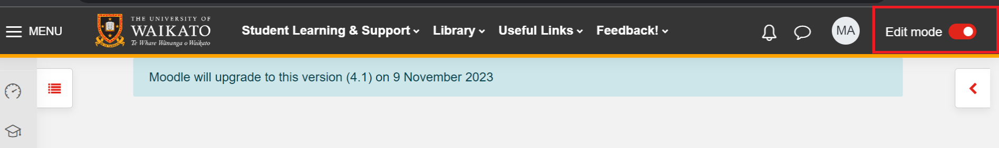
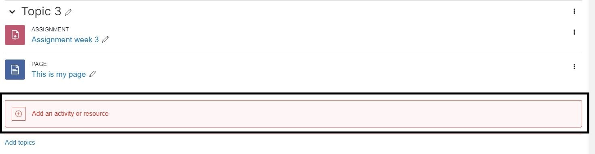
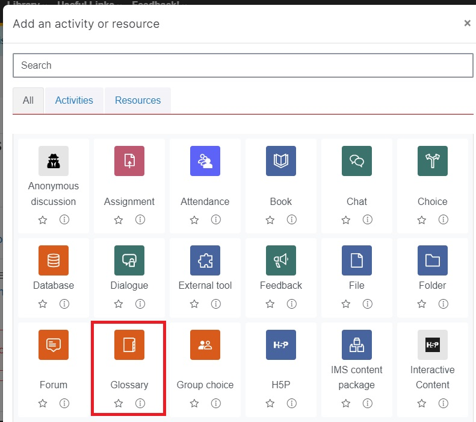
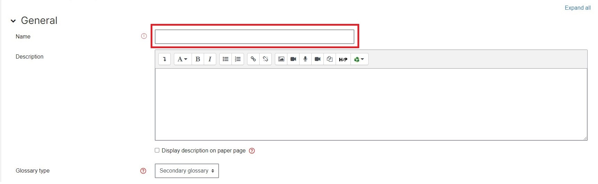
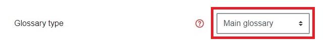
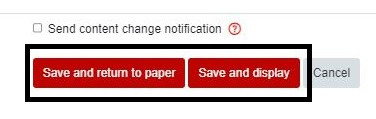

## Glossary

The Glossary activity enables participants to create and maintain a list of definitions, like a dictionary, or collect and organise resources and information. Glossaries can be:
 
- A collaborative bank of key terms;
- A ‘getting to know you’ space where new students add their name and personal details;
- A ‘handy tips’ resource of best practice in a practical subject;
- A sharing area of useful videos, images or sound files;
- A revision resource of facts to remember.

1. On the top right hand corner, toggle **Edit mode** on.
   
   
   
2. At the bottom of the section/topic/week where you would like the Glossary to appear, select **Add an activity or resource**.

   
   
3. Select **Glossary**.

   
   
4. Enter a **Name** in the **text box**.

   
   
5. In the **Glossary type** drop-down menu, choose **Main glossary** or **Secondary glossary**. You can select the **question mark** for a description of each type of glossary.

   
   
6. Scroll down and select **Save and return to paper**.
   
   
   
---

See this video from Moodle Academy for more information on using Glossary.

>[!NOTE]
>The Moodle version and appearance in this video are slightly different from the version at the University of Waikato.

<iframe width="560" height="315" src="https://www.youtube.com/embed/_6ckd1JCDIQ?si=pBDk8dHuLQjqY5mO"></iframe>

