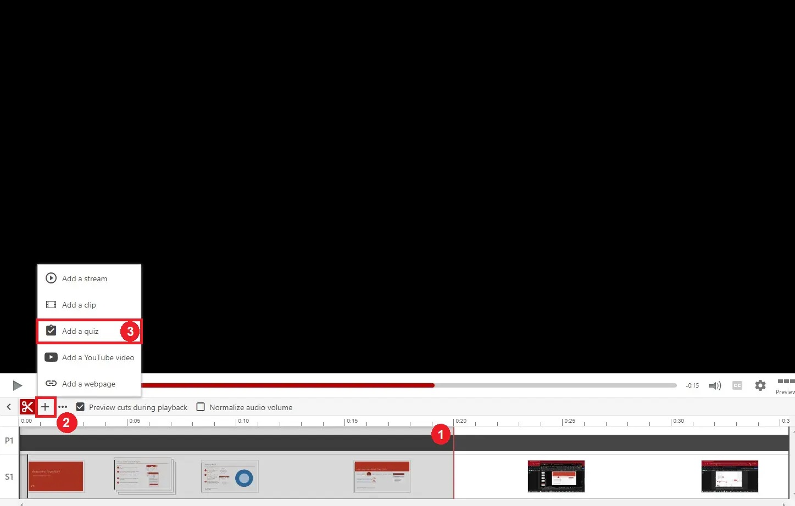
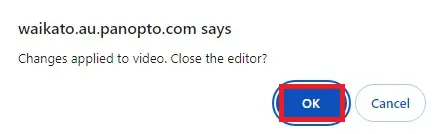

# Adding a quiz to a Panopto recording

<iframe width="560" height="315" src="https://www.youtube.com/embed/yAvWM8bF2E4?si=8PsNgdCM1QKXFnLY"></iframe>

1. To begin, select the **Edit** button that appears when you hover the mouse pointer over a recording.
   
   
   
2. Select the timeline at the point where you want the quiz to appear [1]. Once you have set the timeline, click on the **Add content (+)** icon [2] and select **Add a quiz** [3].

   

3. When you’ve added your quiz questions, select the **Apply** button to save your changes.

   
   
4. Finally, select **OK**.

   

> [!NOTE]
> There are [more detailed instructions](https://support.panopto.com/s/article/How-to-Add-a-Quiz-to-a-Video) on the Panopto support webpage or in our [Elevenses recording](https://coursecast.its.waikato.ac.nz/Panopto/Pages/Viewer.aspx?id=7949810a-4109-4987-b944-abde009665d0).
