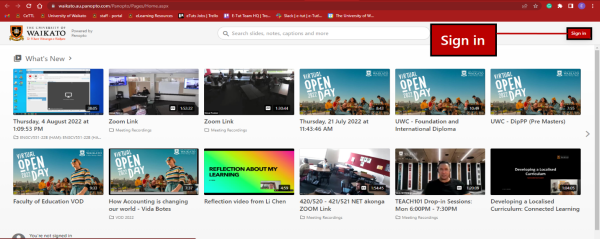

# Copy recordings
> [!IMPORTANT]
> There are 2 types of copy recording: **Full Copy** and **Reference Copy**. You can also add a Panopto recording to a central section of a Moodle paper from your personal folder or from another paper's folder via the new [Panopto video activity](Panopto/add-panopto-video-resource-in-moodle.md) or the [Panopto button in Moodle](Panopto/the-panopto-embed-button.md). 
>
> * If you make a full copy, edits in the copy will not affect the original. This generates a complete copy of the video, devoid of references to the original, enabling independent editing.
> * If you make a reference copy, edits in the copy will be matched in the original. Reference copies are linked to the original source video but have a completely fresh slate of viewer-contributed metadata.

## Steps to do a Full Copy
1. Go to the University of Waikato's Panopto server: [https://waikato.au.panopto.com](https://waikato.au.panopto.com)
2. **Sign in** using drop-down menu in the top right corner using your standard Waikato email and password details.
   
   
4. Select **Browse** on the left-hand side, then select the desired recording.
5. **Tick** your **desired recording**, then select the **copy icon** on the popped-up box.
6. **Chose** the designated folder and select **Copy**.

## Steps to do a Reference Copy
1. Log in by following [steps 1 and 2](#FullCopy) above.
2. In your desired recording, select **Settings**.
3. Select **Manage**.
4. In the Manage tab, select **Create Reference Copy**.
