# Create a recording or Webcast

> [!NOTE]
> * You can also create a Panopto recording via [The Panopto video activity](add-panopto-video-resource-in-moodle.md) or the [The Panopto embed button](the-panopto-embed-button.md) in Moodle.
> * See also: [Making an offline recording](making-an-offline-recording.md) and [Panopto online](record-in-a-browser.md).

1. On your desktop, double-click the **Panopto icon** to open the **Panopto Recorder** app. Alternatively, you can search for the app in your system.

	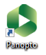

2. Select **Sign in**.

	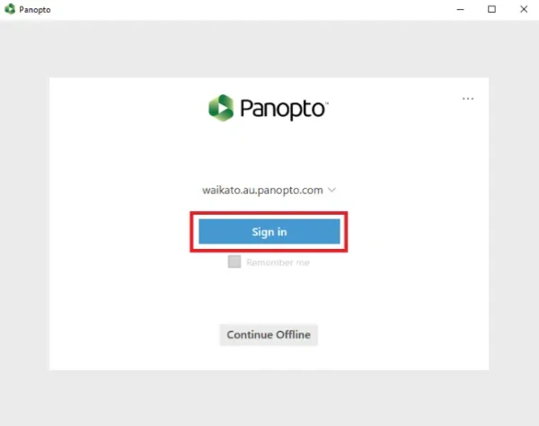
   
3. Enter your standard Waikato username and password, then select **Sign in**.

	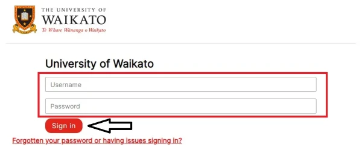

4. Your default web browser will open. Select **Open Panopto Recorder** in the window that pops up to begin using the app.

	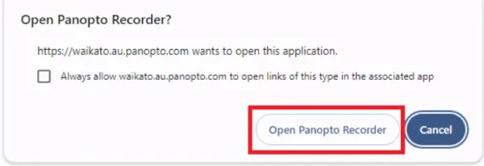

5. Once you are signed in to the Panopto app, click on the **drop-down arrow** to select the Folder where you want to save your recording.

	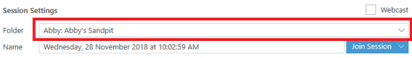

> [!NOTE]
> If your desired paper/folder is not available, the folder or your access to the folder may not be correctly set up. You can record to another folder, and [Move the recording](move-panopto-recordings.md) later.

6. **Name** your recording so that it is easy for you and your participants to find.

	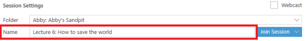
   
7. Select **Primary Sources** and **Secondary Sources** (e.g. audio, video, screen, PPT, Document Camera).

> [!NOTE]
> Ensure that you have selected an **Audio** source, and the sound meter shows audio levels are OK.
> 
> 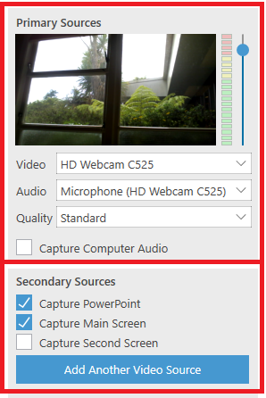

8. (a) To start recording, select the **Record button** at the top left-hand corner.

   (b) If you want to broadcast the session to a live audience, select the tick box next to **Webcast** at the top right, then select **Record**.

	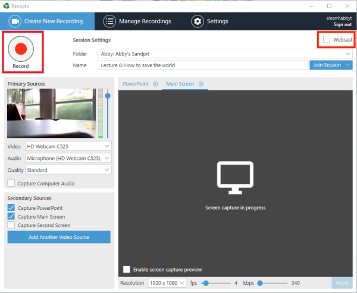

> [!NOTE]
> If you are webcasting, students can access the live session by going to the **Panopto block** in the Moodle paper, and under **Currently Recording**, selecting **Watch Live**.
> 
> 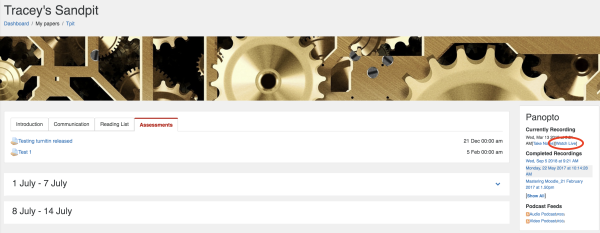

9. When you have finished recording, select **Stop**. This step saves your recording.

	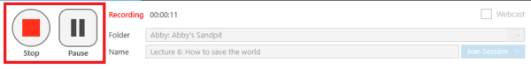

> [!NOTE]
> You can **Pause** the recording and **Start** again when ready. Recording continues in the background and can usually be retrieved in editing, if you remember to **Stop** the recording to save it.

10. Select **Delete and record again** if you are not happy with your recording and want to re-do it, or **Upload** if it is fine.

	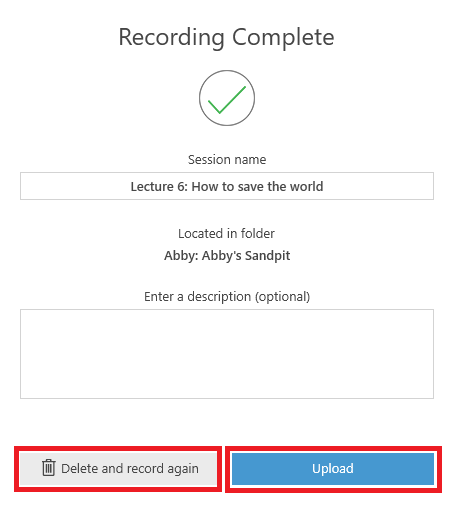

> [!NOTE]
> After selecting **Upload**, the recording will be first uploaded to the Panopto database, then processed before being made available for viewing, editing and sharing. You can log out after the upload is complete (make sure to not log out before), the processing will not be affected. The processing time may take up to a few hours.

