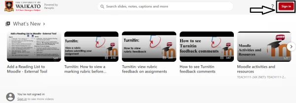
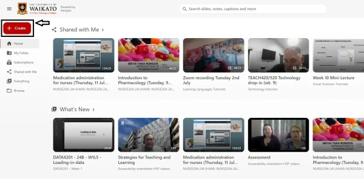
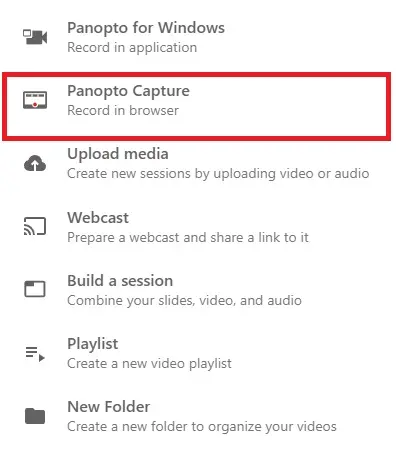
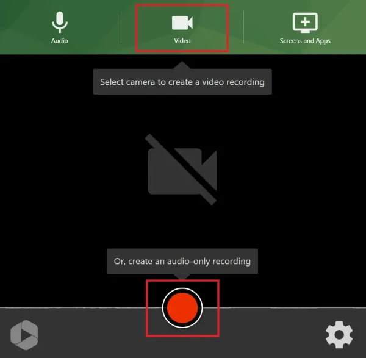
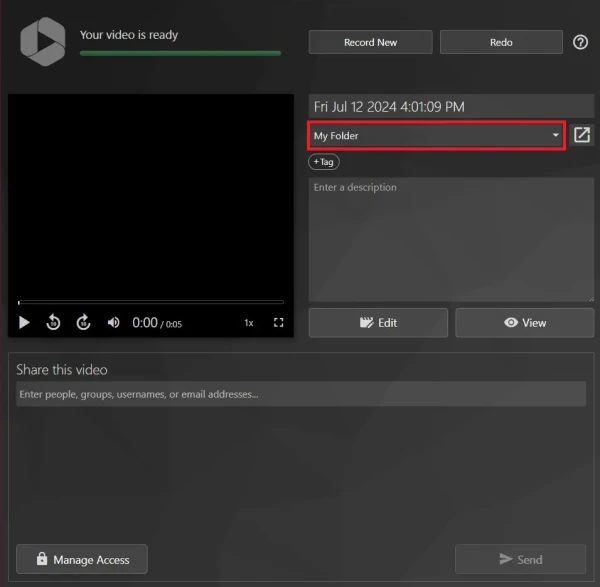

# Make a Panopto recording in a browser

This webpage will assist you in recording to Panopto in a web browser. 

> [!NOTE]
> * You can also record to Panopto from your Moodle papers using the [Panopto video resource](Panopto/add-panopto-video-resource-in-moodle.md) or the [Panopto embed button](Panopto/the-panopto-embed-button.md).

1. Go to the University of Waikato's Panopto server:
https://waikato.au.panopto.com

2. At the top right corner, select **Sign in**.
   

3. Once signed in, at the top left of the homepage, select the **Create** button.

4. In the drop down menu, select **Panopto Capture**.

> [!NOTE]
> Ensure you allow permission for the web browser to use the camera and audio.

5. When you are ready, select **Video Camera** if you wish to start a video recording, then select the red **Record** button to start recording.

> [!NOTE]
> You can also record your screen share by selecting the **Screens and Apps** option from the top menu.

6. After you press the red **Stop** button, your recording will be uploaded to the folder you selected.

