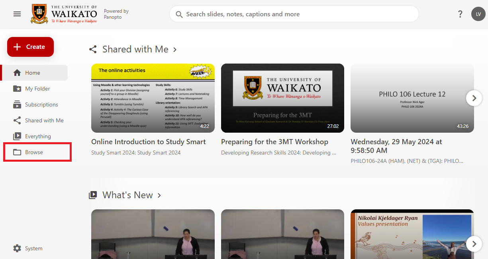

# Share folders

> [!ATTENTION]
> * If your Moodle paper has a configured Panopto block, paper participants can view the recordings in its Panopto folder. To share your folder with someone who is not a participant in its associated Moodle paper, follow these steps.
> * To share a whole folder with someone who is not a participant in its associated Moodle paper, follow these steps.

1. Go to the University of Waikato's Panopto server: [https://waikato.au.panopto.com](https://waikato.au.panopto.com)

2. At the top right corner, select **Sign in**.

3. On the left-hand side, select **Browse**.
   

4. Select **My folders**.

5. Right-click on the folder you want to share, select **Share**.

> [!NOTE]
> Alternatively, you can select the **Folder** you wish to share, and click on the **Share icon** at the top right of your screen.
> 
> 

6. A pop-up window will display options for **People and Groups** and **Who can access this folder**, which are described in the following sections.

## People and Groups
1. To add more people and groups to this folder, start typing the user's or group's name in the **Add people and groups** box. Then, select the name you were looking for from the list.

> [!TIP]
> If you are adding a paper group, there may be multiple options for the same paper code and year. Hover your cursor over the group to see the group's full name.
> 
> 

2. Select the **Drop-down arrow** on the box to the right to choose the role options: Creator, Viewer, or Viewer With Link.

3. When you are done, select **Save**. You will see the new people and groups added to the list below.

> [!NOTE]
> If you wish to send a notification to the participants you have selected, toggle the switch for **Send an email to notify people**, and a **Message** box will appear below for you to write a notification message. Then, select **Send**.
> 
> 

## Who can access folder

1. By default, the folder is set to **Restricted**, with the list of people and groups of people who have been granted access to the folder. To edit access restriction to the folder, select **Change** under **Who can access this folder**.

   
3. A list of different types of access restrictions for the folder will appear. Select your preferred option.

   * **Your Organization (unlisted):** the person trying to access the folder must be logged in with a University of Waikato account, and you need to send them the shared link via email.
   * **Your Organization:** the person trying to access the folder must be logged in with a University of Waikato account, but they do not need you to send them the link to the folder to find it.
   * **Public (unlisted):** the person trying to access the folder does not need a University of Waikato account to access the folder but still needs you to send them the folder link to find it.
   * **Public:** anyone looking for this folder on the Internet can find and access it.
> **Note:**
> To share a link of the folder via email, select Copy Link for individuals to be able to access the folder.
> 
> 
