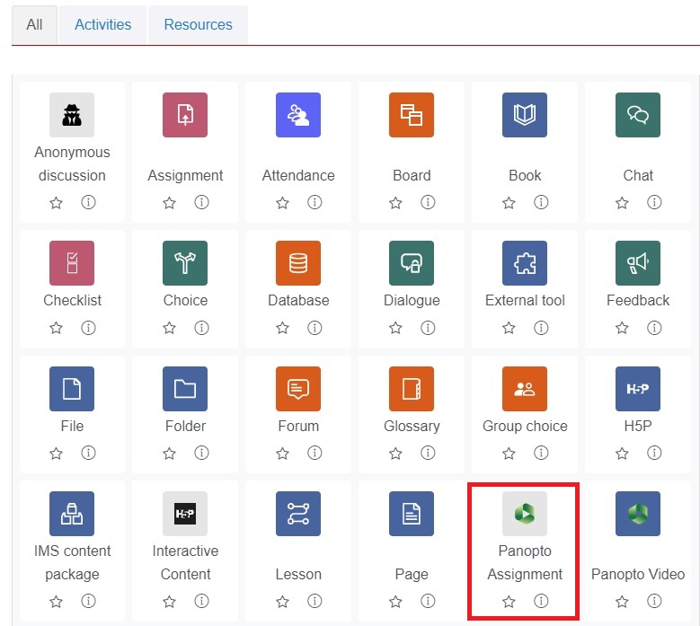

# Student assignments

There is a new <a href="https://www.waikato.ac.nz/students/eresources/moodle/assignments/panopto-assignments/" target="_blank">Panopto assignment</a> tool that you can add via the Add an activity or resource menu in Moodle. The Moodle plugin manages all the creation and permission settings and assignments can be graded.

---
> [!NOTE]
> If you prefer to create a student assignment folder via Panopto, using the previous method, see the [Create a student assignment folder in Panopto](/CeTTL/eResources/Panopto/create-a-student-assignment-folder-in-Panopto.md). This method is useful if you would like students to share multiple files, or you want them to upload videos for non-assignment purposes.

Please see also: 

- The Panopto assignment grading page for differences between Panopto assignment grading and standard Moodle grading. 

- The [Panopto](https://www.waikato.ac.nz/students/teaching-and-learning/student/help-with-technology/panopto/) help page for students. 
