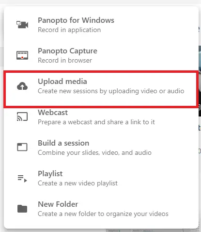
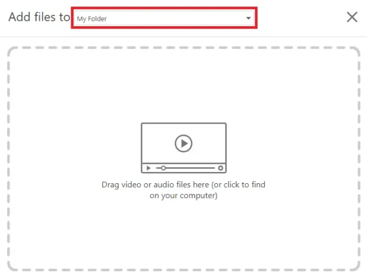
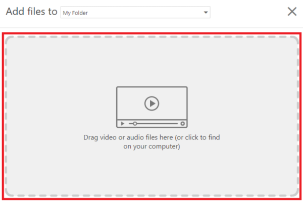

# Upload a recording

== These instructions are for uploading recordings which have been recorded in other software. ==

1. Go to https://waikato.au.panopto.com

2. **Sign in** using the drop-down menu in the top right corner using your standard Waikato account details.

    

3. At the left of the page, select **Create**.

    

4. Select **Upload media**.

    

5. A pop-up box will appear to upload your file. Select the **drop-down arrow**, then in the drop-down list select the **folder** where your recording will be saved. This is usually a paper folder..

    

6. **Drag and drop** your file into the field provided to upload. You can also select the icon to search your files and upload.

   

8. Finally, wait for the upload to complete.
